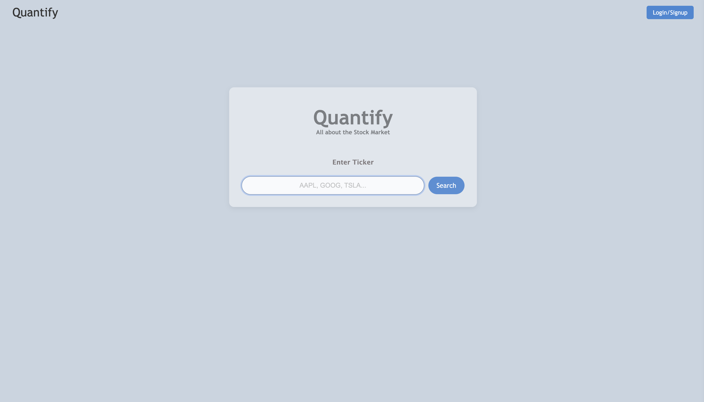
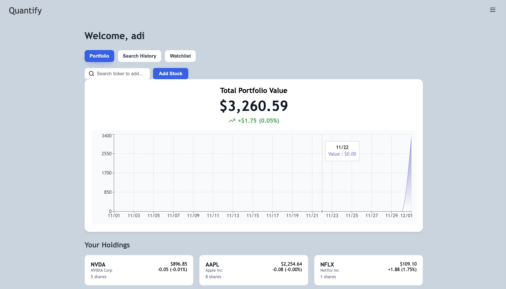
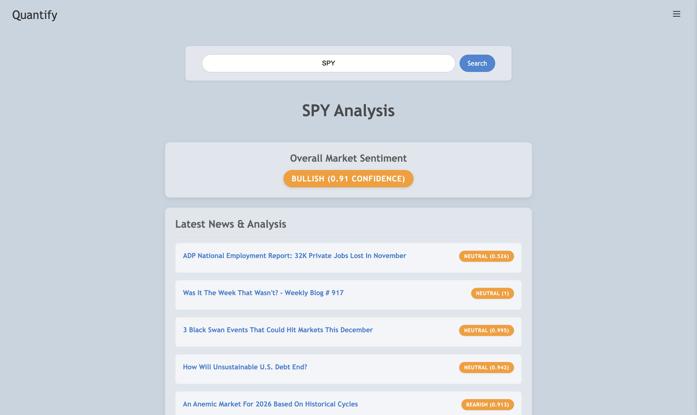

# Quantify

> High-end market intelligence and portfolio management in one experience.

  
  
<i>Search tickers, analyze stocks and overall market, and track portfolio.</i>

## Description
Quantify blends real-time market data with AI-powered news sentiment so you can see both the numbers and the narrative. Log in, search any ticker, view the latest headlines scored as Bullish/Bearish/Neutral, and manage your personal portfolio from a modern dashboard.

- **Dashboard:** Track total value, P&L, and drill into individual holdings with mini-charts and quick buy/sell actions.
- **Personalized workflows:** Switch between Portfolio, Search History, and Watchlist to keep your research organized.

## Product tour
- **Home & Search** – Enter a ticker to get curated news with confidence scores and an overall market sentiment badge.
- **Portfolio** – See total equity, gains/losses, and a snapshot chart; expand holdings for quick actions.
- **Search History & Watchlist** – Keep tabs on what you’ve researched and the symbols you’re monitoring next.

  <table>
    <tr>
      <td align="center"> Portfolio overview</td>
      <td align="center"> News + sentiment</td>
    </tr>
  </table>

- **Frontend:** React, React Router, Recharts, Lucide icons
- **Backend:** Flask, JWT auth, Finnhub news feed, FinBERT sentiment analysis
- **Data:** SQLite for users/portfolio, local storage for session tokens
